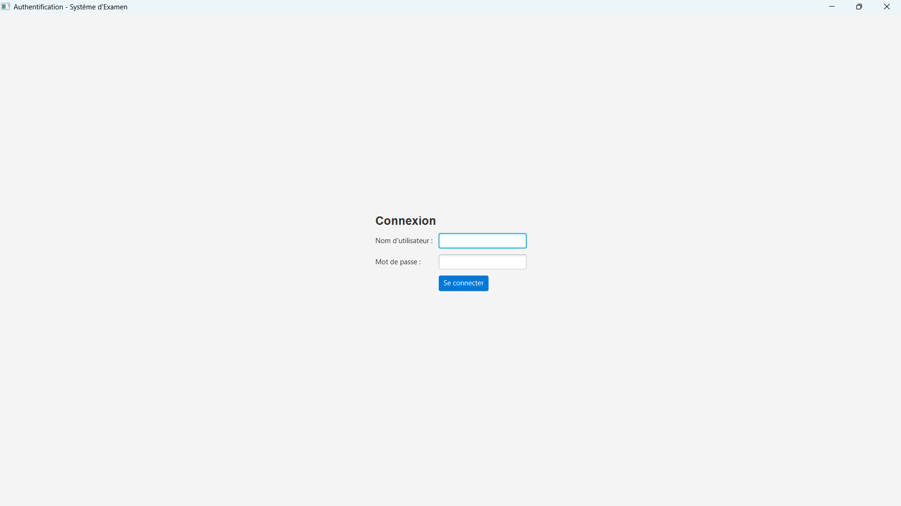
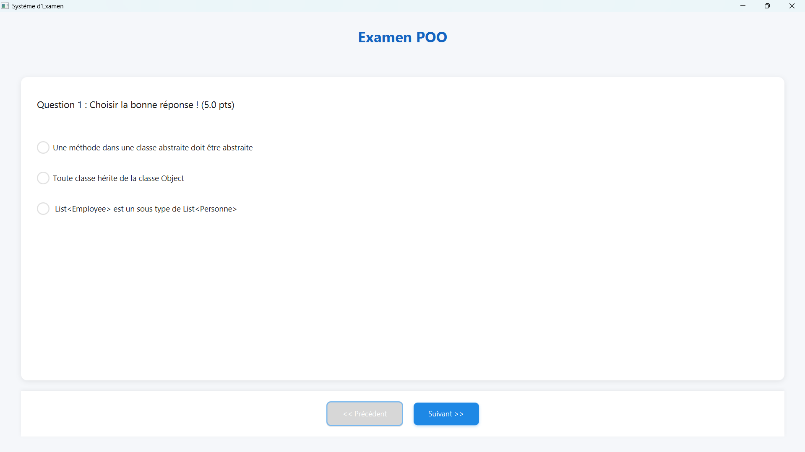
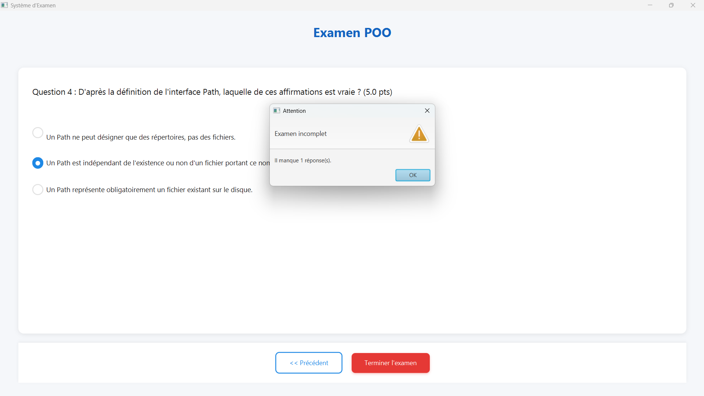

<div align="center">

# 🎓 AutoExam

### Système intelligent de gestion et correction automatisée d'examens


</div>

---

## 📋 Description (Overview)

**AutoExam** est une application de bureau (*desktop application*) développée en **Java/JavaFX** qui permet aux enseignants de créer des examens structurés et aux étudiants de les passer dans une interface graphique moderne. Le système corrige automatiquement les réponses, génère un bulletin de notes, et gère l'authentification via une base de données (*database*) MySQL. Conçu pour illustrer les concepts avancés de la Programmation Orientée Objet (*Object-Oriented Programming - OOP*), ce projet met en œuvre des principes de génie logiciel (*software engineering*) robustes et maintenables.

---

## ✨ Fonctionnalités et Concepts Techniques (Core Features & Technical Concepts)

Ce projet a été conçu pour démontrer la maîtrise des concepts suivants :

### 🗄️ **1. Base de données & JDBC (Database & JDBC)**
- **Implémentation** : La classe `GestionBaseDonnees` établit une connexion avec MySQL via le pilote JDBC (*Java Database Connectivity*).
- **Fonctionnalités** :
    - Authentification des étudiants (vérification identifiant/mot de passe)
    - Chargement dynamique des questions depuis la table `questions`
    - Stockage persistant des examens et des utilisateurs
- **Requêtes SQL** : Utilisation de `PreparedStatement` pour prévenir les injections SQL (*SQL injection prevention*)

### 📦 **2. Collections (Collections Framework)**
- **`List<Question>`** : Stockage ordonné de toutes les questions de l'examen dans la classe `Examen`
- **`Map<Integer, String>`** : Mémorisation des réponses de l'étudiant avec la clé = index de la question, valeur = réponse saisie
- **Avantages** : Manipulation efficace des données avec les API standards Java (*standard Java APIs*)

### 🔤 **3. Méthodes/Classes génériques (Generics)**
- **Typage générique** : Les collections utilisent des types paramétrés pour garantir la sécurité de type (*type safety*) à la compilation
```java
  List<Question> questions = new ArrayList<>();
  Map<Integer, String> memoireReponses = new HashMap<>();
```
- **Bénéfice** : Élimination des erreurs de casting (*ClassCastException*) et amélioration de la lisibilité du code

### ⚠️ **4. Exceptions personnalisées (Custom Exceptions)**
- **Classe** : `ExamenNonTermineException extends Exception`
- **Déclenchement** : Lancée lorsque l'étudiant tente de terminer l'examen sans avoir répondu à toutes les questions
- **Gestion** : Affichage d'une boîte de dialogue (*alert dialog*) JavaFX avec le nombre de réponses manquantes
- **Validation métier** : Implémente une règle métier stricte (*business rule enforcement*)

### 📄 **5. Fichiers E/S (File I/O - Input/Output)**
- **Classe** : `ServiceFichier`
- **Fonctionnalité** : Génération automatique d'un fichier texte `bulletin_notes.txt` contenant :
    - Nom de l'étudiant
    - Note finale obtenue
    - Horodatage (*timestamp*)
- **Technologie** : API `java.io` pour l'écriture sur le système de fichiers (*file system*)

### 🎨 **6. Interface Graphique (GUI - Graphical User Interface)**
- **Framework** : JavaFX 21+ avec pattern MVC (*Model-View-Controller*)
- **Design moderne** :
    - Fichier CSS externe (`style.css`) avec palette de couleurs professionnelle
    - Composants stylisés : boutons arrondis, cartes avec ombres portées (*drop shadows*), champs de texte modernes
    - Responsive layout avec `BorderPane`, `VBox`, `HBox`
- **Navigation** : Système de pagination pour parcourir les questions avec sauvegarde automatique des réponses

---

## 🏗️ Architecture POO (OOP Architecture)

### Principes appliqués :

- **Classe abstraite** : `Question` (classe mère abstraite)
    - Attributs communs : `enonce`, `score`
    - Méthode abstraite : `corriger(String reponse)` → impose un contrat (*contract*) aux sous-classes

- **Polymorphisme (Polymorphism)** :
    - `QuestionQCM extends Question` → redéfinit `corriger()` pour comparer l'index de la réponse avec `reponsesCorrecte`
    - `QuestionNumerique extends Question` → redéfinit `corriger()` pour vérifier la valeur numérique avec tolérance

- **Encapsulation (Encapsulation)** : Attributs privés avec getters/setters

- **Séparation des responsabilités (Separation of Concerns)** :
    - Logique métier (*business logic*) : Classes `Examen`, `Question`
    - Accès aux données (*data access layer*) : `GestionBaseDonnees`
    - Présentation (*presentation layer*) : `ExamenFX`, `LoginFX`
    - Services transverses (*cross-cutting concerns*) : `ServiceFichier`

---

## 🛠️ Technologies (Tech Stack)

| Composant | Technologie |
|-----------|-------------|
| **Langage** | Java 17+ |
| **Framework GUI** | JavaFX 21 |
| **Base de données** | MySQL 8.0 |
| **Build Tool** | Maven (avec Maven Wrapper) |
| **Styling** | CSS3 (fichier externe) |
| **IDE recommandé** | IntelliJ IDEA / Eclipse / NetBeans |
| **JDBC Driver** | MySQL Connector/J |

---

## 📸 Aperçus de l'interface (Screenshots)

### Écran de connexion (Login Screen)


### Passage de l'examen (Exam Interface)


### Gestion des exceptions (Exception Handling)


---

## 🚀 Installation et Exécution (Setup & Run)

### Prérequis (Prerequisites)
- **Java JDK 17+** installé ([Télécharger ici](https://www.oracle.com/java/technologies/downloads/))
- **MySQL Server 8.0+** en cours d'exécution
- **Git** pour cloner le dépôt

### Étapes d'installation

#### 1️⃣ Cloner le dépôt (Clone the repository)
```bash
git clone https://github.com/hamoudiayoub891-commits/AutoExam.git
cd AutoExam
```

#### 2️⃣ Configurer la base de données (Database setup)
```bash
# Connectez-vous à MySQL
mysql -u root -p

# Exécutez le script SQL fourni
source database/schema.sql
```

Le script créera automatiquement :
- La base de données `autoexam_db`
- Les tables `users`, `questions`, `examens`
- Des données de test (compte étudiant : `user123` / `pass123`)

#### 3️⃣ Configurer les identifiants de connexion (Configure DB credentials)
Éditez le fichier `GestionBaseDonnees.java` avec vos informations MySQL :
```java
private static final String URL = "jdbc:mysql://localhost:3306/autoexam_db";
private static final String USER = "root";
private static final String PASSWORD = "votre_mot_de_passe";
```

#### 4️⃣ Compiler et exécuter (Build & Run)

**Avec Maven Wrapper (recommandé)** :
```bash
# Linux/Mac
./mvnw clean javafx:run

# Windows
mvnw.cmd clean javafx:run
```

**Avec un IDE** :
1. Importer le projet Maven
2. Laisser l'IDE télécharger les dépendances (*dependencies*)
3. Exécuter la classe `Main.java`

---

## 📚 Structure du projet (Project Structure)
```
AutoExam/
├── src/
│   ├── main/
│   │   ├── java/
│   │   │   └── AutoCorrectionExamen/
│   │   │       ├── Main.java
│   │   │       ├── LoginFX.java
│   │   │       ├── ExamenFX.java
│   │   │       ├── Question.java (abstract)
│   │   │       ├── QuestionQCM.java
│   │   │       ├── QuestionNumerique.java
│   │   │       ├── Examen.java
│   │   │       ├── GestionBaseDonnees.java
│   │   │       ├── ServiceFichier.java
│   │   │       └── ExamenNonTermineException.java
│   │   └── resources/
│   │       └── style.css
├── database/
│   └── schema.sql
├── bulletin_notes.txt (généré automatiquement)
├── pom.xml
└── README.md
```

---

## 👥 Auteurs (Authors)

- **Ayoub Hamoudi** - Développement principal, Architecture, UI/UX Design

---

## 📄 Licence (License)

Ce projet est développé dans un cadre pédagogique (*academic purposes*) pour le cours de Programmation Orientée Objet.

---

## 🎯 Objectifs pédagogiques atteints (Learning Objectives Achieved)

✅ Maîtrise de la POO avancée (héritage, polymorphisme, abstraction)  
✅ Manipulation des collections Java (*Java Collections Framework*)  
✅ Connexion et requêtes JDBC avec base de données relationnelle  
✅ Création et gestion d'exceptions personnalisées  
✅ Lecture/Écriture de fichiers (*File I/O*)  
✅ Développement d'interfaces graphiques modernes avec JavaFX  
✅ Séparation des responsabilités et architecture en couches (*layered architecture*)  
✅ Intégration CSS pour un design professionnel

---

<div align="center">

**Développé avec ❤️ pour démontrer l'excellence en génie logiciel**

</div>